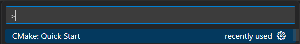

# 환경 세팅  
  
   
## Visual studio code 에서 c/cpp 환경구축
<br/>
이하 내용은 전부 window 환경을 전제한다.
<br/>

<aside>
💡 c/cpp 개발 환경을 vscode에서 구축하는 방법을 학습한다. visual studio와 같은 c 개발에 용이한 환경을 만들기 위해서는 CMake, LLVM-Clang, Ninja를 설치하여야 한다.

</aside>

Cmake : 프로젝트를 관리해주는 파일, 외부 라이브러리 링크, 소스코드 관리 등의 기능을 한다.(빌드 파일을 생성하는 프로그램)

LLVM-Clang : clang은 LLVM을 사용하여 컴파일 하기 때문에 최적화 단계에서 더 빠르게 실행이 가능하며, 타 컴파일러에 비해 엄격한 C++ 규칙을 적용하기 때문에 더욱 정확한 오류 메시지를 제공한다. 또한 라이선스 측면에서의 이점도 존재하는듯하다.

Ninja : cmake와 비슷한 build tool, 일반적으로 기본 make 와 같은 tool에 비해 빠르다고 알려져 있다. cmake 와 함께 사용한다. 

[ninja releases 설치링크](https://github.com/ninja-build/ninja/releases)

[llvm releases 설치링크](https://github.com/llvm/llvm-project/releases)

<br/>

개발환경 : 

```c
C:\Users\oooo>cmake --version
cmake version 3.25.2
C:\Users\oooo>ninja --version
1.11.1
C:\Users\oooo>clang --version
clang version 15.0.7
```
<br/>

Ninja 설치 시 유의 사항

- C:\ProgramFiles\Ninja\bin 경로 폴더 만든 후 ninja.exe 파일 추가
- C:\ProgramFiles\Ninja\bin\ 경로 시스템 환경 변수에 추가 (all users에 추가하는 것을 추천)

<br/>

## install extention

<aside>
💡 recommend vs code extensions 
C/C++ : microsoft
C/C++ Extension Pack: microsoft
CMake Tools: microsoft

</aside>

## starting project

1. 프로젝트 생성을 원하는 폴더에 command palette 에서 Cmake:Quick Sart 선택
2. Scan for kits 선택
    1. 컴퓨터에 깔려있는 compiler 찾아준다.
3. 1 번 반복
4. 원하는 compiler 선택(예제 경우 clang_cl 이 아닌 clang 선택)
    1. clang_cl 은 visual studio 20XX용이다
5. 프로젝트명 입력 및 library executable 중 선택
6. CMake: configure  (generate a build system for your project based on the contents of your env)
7. 하단 Status bar에서 프로젝트 빌드, 실행 등 진행 가능 , CMake: Select Variant 에서 Debug, Release 등 선택 가능




**기본 용어 정리**

object code : source code를 compile 한 결과물이다. 

exe vs obj??

linker  : 오브젝트 파일을 결합하여 실행 가능한 바이너리 파일을 생성한다.

build : 컴파일, 링크, 바이너리파일 테스트 등을 진행하는 일련에 과정 

Debug / Release : debug 모드를 통한 빌드시 선택 시 좀 더 구체적인 에러 메시지를 확인이 가능하며(당연히 시간은 더욱 오래 걸린다) release는 배포를 목적으로 한다, 상황에 따라 둘 중 적합한 것을 사용해주자 

configure : 프로그램을 만들 때, 소스 코드를 컴파일하여 실행 파일을 만들어야 한다. 그러나 소스 코드가 복잡하고 여러 파일로 구성되어 있을 경우, 이를 수동으로 컴파일하는 것은 매우 어렵다. 이때 `cmake`와 `configure`와 같은 빌드 시스템을 사용하면, 소스 코드를 컴파일하는 데 필요한 모든 설정을 자동으로 수행할 수 있다

cmake : configure 의 단점을 보완한 것으로, `cmake`를 사용하여 프로젝트를 구성하면, `CMakeLists.txt` 파일에 지정된 대로 빌드 구성을 생성할 수 있다. 이 구성은 빌드 환경에 따라 다르며, 예를 들어 Windows에서는 Visual Studio 프로젝트 파일을 생성하고, Linux에서는 Makefile을 생성할 수 있다. cmake configure단계는 `cmake`를 실행할 때 자동으로 수행되며,(빌드 폴더가 생성된다) 이후에는 `cmake build` 단계를 수행하여 실제 빌드를 수행할 수 있다. 이를 통해 코드를 더 쉽게 빌드하고 실행 파일을 만들 수 있다.

## git hub

git을 사용할 때 SSH를 사용하면 보안성과 속도 면에서 이점을 얻을 수 있다.

```bash
cd ~ 
ls .ssh # 최초설정이라면 별 내용이 생기지않을 것
ssh-keygen
ls .ssh #id_rsa  id_rsa.pub  known_hosts 이런식에 무언가 나와야한다, 사전 git 사용 여부에 따라 조금 달라질 수 있다.
cat .ssh/id_rsa.pub #id_rsa는 개인키임으로 유출하지 않도록 조심하자
#다음 값을 모두 복사한다(ssh-rsa AA~~~~) 복사한 값은 github 설정에서 SSH key에 적당한 이름과 함께 등록해준다
ssh -T git@github.com #깃허브와 연결해준다

#git 설정이 처음인 사람들은 git config 를 통해 이메일과 유저명을 추가적으로 등록해주어야한다
```


SSH key등록을 하는 github 설정 창이다. 만약 모든 과정을 잘 마무리하였다면 문제없이 SSH를 이용하여 프로젝트를 clone해올 수 있을 것이다. 

## OpenCV 환경 구축

1. 적당한 버전에 opencv를 본인 환경에 맞도록 다운 받는다. mac은 직접 빌드하여야한다. 
    
    [https://opencv.org/releases/](https://opencv.org/releases/)
    
2. 프로젝트 root에  빈 thrid_party 폴더를 생성한다.
3. 다운 받은 opencv exe파일을 실행하고 앞서 만든 thrid_party의 경로로 설치 경로를 바꿔준다. 
4. cmake 파일이 다운 받은 opencv 폴더를 인식할 수 있도록 cmakelists.txt 를 수정한다.
    
    ```makefile
    cmake_minimum_required(VERSION 3.0.0)
    project(Top)
    
    # OpenCV 4.7.0
    set(OpenCV_DIR ${CMAKE_SOURCE_DIR}/third_party/opencv/build)
    set(OpenCV_STATIC_LIB  ${OpenCV_DIR}/x64/vc16/lib/opencv_world470.lib)
    set(OpenCV_DYNAMIC_LIB ${OpenCV_DIR}/x64/vc16/bin/opencv_world470.dll)
    include_directories(${OpenCV_DIR}/include)
    
    # Data
    
    # Projects
    
    #cmake 의 기본적인 함수들은 아래 블로그를 참고하면 좋을 것 같다.
    #https://coding-robot.tistory.com/8
    #https://www.tuwlab.com/ece/27260
    ```
    
5. 이제 Variant를 Release로 설정한 후  build all 을 시도하여본다 마찬가지로 status bar에서 조절이 가능하다.
    
    
    
6. 이제 원하는 cpp 파일을 실행하거나 디버그 하면 된다!(status bar을 이것저것 눌러보며 기능을 탐색하는 것을 추천한다.)


<br/>

궁금한 점이 있다면 남겨주세요! 함께 고민해보겠습니다.

------------------------